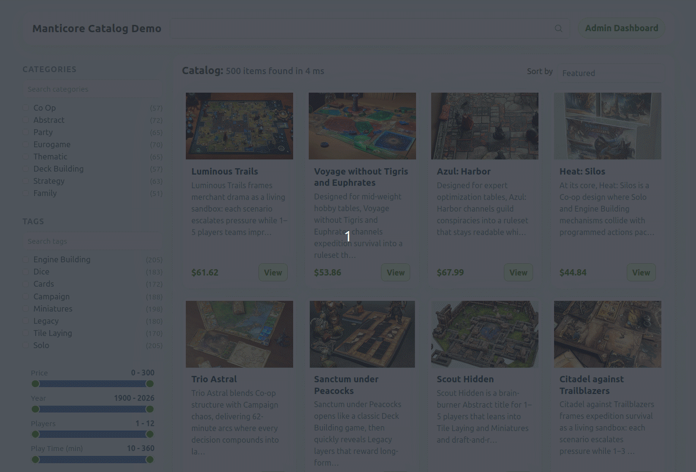

## Implementing Modern Search in PHP Using Manticore: Practical Guide

Search is one of the highest-leverage capabilities in data-heavy apps. This guide shows how this project uses **Manticore Search** and the **Manticore PHP client** to implement production-style search patterns: full-text, fuzzy, facets, filters, autocomplete, hybrid retrieval, KNN similarity, and scroll pagination.

By the time you finish this guide, you will have:

- an RT table that is fully searchable and taxonomy-aware
- a clean PHP integration layer built on Manticore PHP client
- search-as-you-type behavior, autocomplete, and facet-driven navigation
- semantic retrieval patterns with hybrid search and KNN
- reliable scroll-based pagination for deep result browsing

---

## Contents

- Requirements
- Environment setup
- Try the hosted demo
- Initialize the Manticore PHP client
- Model your data for search
- Load initial data
- Manage catalog data with CRUD
- Build the core search loop
- Add semantic retrieval (hybrid + KNN)
- Paginate safely with scroll tokens
- Implementation notes

---

## Requirements

- PHP 8.1+
- Composer
- Running Manticore with HTTP API
- `manticoresearch-php` client (installed via Composer in this app)
- Slim Framework (used for routing/controllers around the search layer)


---

## Environment Setup

We start by bringing up Manticore and installing the PHP dependencies. 

### Launching Manticore in Docker

Recommended local setup in this repo uses Docker Compose, so we can start the search node with one command and keep the setup reproducible across environments.

If Docker is not part of your stack, Manticore also supports native installation on Debian/Ubuntu, RHEL/CentOS, macOS, and Windows, as well as builds from source. You can follow the official installation guide for those paths:

- https://manual.manticoresearch.com/Installation

To start Manticore with Docker Compose in the repository, run:

```bash
cd <repo-root>
docker compose up -d
```

Then install the PHP app dependencies:

```bash
cd app
composer install
```

To configure how the PHP app connects to Manticore and which host/port it serves on, create an `.env` from the provided template:

```bash
cp <repo-root>/app/.env.example <repo-root>/app/.env
```

Finally, start the app locally:

```bash
cd <repo-root>/app
php bin/bootstrap-demo.php
php -S localhost:8081 -t public
```

Then just open `http://localhost:8081/` and the demo is here:


### Try the Hosted Demo

If you want to see the project behavior immediately, you can try a hosted demo instance:

- https://demo-catalog.manticoresearch.com


## Initialize the Manticore PHP Client

In our app, we initialize the Manticore client once at startup and pass it to services/controllers that execute search and indexing operations.

Here’s a snippet from the app which does this:

```php
$settings = require $root . '/config/settings.php';

$client = new Client([
    'host' => $settings['manticore']['host'],
    'port' => $settings['manticore']['port'],
    'transport' => $settings['manticore']['transport'],
]);

$indexManager = new IndexManager($client, $settings['table']);
$importer = new CsvImporter($client, $indexManager, $logger, $settings);
$catalogController = new CatalogController($twig, $client, $settings);
```

This keeps connection setup centralized and makes host/port changes straightforward via config.

---

## Model Your Data for Search

In our demo, we model a board-game catalog. Each document represents one game with a searchable title/description, structured metadata for filtering (price, release year, player counts, play time), taxonomy fields (category/tags), and a vectorized description for semantic retrieval.

The project stores Manticore schema in `app/config/settings.php`.

Here you can see the schema excerpt:

```php
  'table' => [
        'name' => 'catalog_board_games',
        'columns' => [
            'title' => ['type' => 'string'],
            'description' => ['type' => 'text', 'options' => ['indexed', 'stored']],
            'category_id' => ['type' => 'integer'],
            'tag_id' => ['type' => 'multi64'],
            'price' => ['type' => 'float'],
            'player_count_min' => ['type' => 'integer'],
            'player_count_max' => ['type' => 'integer'],
            'play_time_minutes' => ['type' => 'integer'],
            'publisher' => ['type' => 'string'],
            'designer' => ['type' => 'string'],
            'release_year' => ['type' => 'integer'],
            'image_url' => ['type' => 'string'],
            'created_at' => ['type' => 'timestamp'],
            'updated_at' => ['type' => 'timestamp'],
            'description_vector' => [
                'type' => 'float_vector',
                'options' => [
                    'KNN_TYPE' => 'hnsw',
                    'HNSW_SIMILARITY' => 'l2',
                    'MODEL_NAME' => 'sentence-transformers/all-MiniLM-L6-v2',
                    'FROM' => 'description',
                ],
            ],
        ],
        'settings' => [
            'morphology' => 'stem_en',
            'min_word_len' => 2,
            'dict' => 'keywords',
            'min_infix_len' => 2,
        ],
        'taxonomy_tables' => [
            [
                'name' => 'catalog_categories',
                'columns' => [
                    'label' => ['type' => 'string'],
                ],
                'settings' => [],
            ],
            [
                'name' => 'catalog_tags',
                'columns' => [
                    'label' => ['type' => 'string'],
                ],
                'settings' => [],
            ],
        ],
    ],
```

Main RT table:

- `catalog_board_games`
- text fields: `title`, `description`
- numeric attributes for filtering/sorting: `price`, `release_year`, player counts, play time
- taxonomy attributes: `category_id`, `tag_id` (`multi64`)
- vector field: `description_vector` with auto-embedding from `description`

Taxonomy tables:

- `catalog_categories`
- `catalog_tags`

Table structures are managed through the app's Manticore configuration and bootstrap/import flow.

---

## Load Initial Data

The demo uses a prepared dataset that is already included in the project and imported into the `catalog_board_games` Manticore table.

To load records from fixtures, run:

```bash
cd <repo-root>/app
php bin/bootstrap-demo.php
```

In this demo, we use two import modes so you can conveniently experiment with the data::

- "Reset" import: idempotent import for deterministic reloads, performed automatically when the app starts.
- "Add-on" import: import new rows through the app' admin UI without replacing existing records.

---

## Manage Catalog Data with CRUD

Beyond search, admin page handlers demonstrate direct document lifecycle operations through `Manticoresearch\Table`.

### Create

```php
$table = $client->table('catalog_board_games');
$table->addDocument([
    'title' => 'New Game',
    'description' => 'Fast cooperative strategy game.',
    'category_id' => 4,
    'tag_id' => [3, 9, 11],
    'price' => 29.99,
    'release_year' => 2026,
    'created_at' => time(),
    'updated_at' => time(),
]);
```

### Read

Single document:

```php
$hit = $table->getDocumentById($id);
```

List with paging/sorting:

```php
$search = new Search($client);
$search->setTable('catalog_board_games')
    ->search('*')
    ->sort('created_at', 'desc')
    ->limit($perPage)
    ->offset(($page - 1) * $perPage);
$resultSet = $search->get();
```

### Update

```php
$table->replaceDocument([
    'title' => $title,
    'description' => $description,
    'category_id' => $categoryId,
    'tag_id' => $tagIds,
    'price' => $price,
    'updated_at' => time(),
], $id);
```

### Delete

```php
$table->deleteDocument($id);
```

We already use batch operations in the importer: `addDocuments()` for append mode and `replaceDocuments()` for idempotent reloads. The Manticore PHP client also provides `deleteDocuments()` for query-based bulk deletes.

```php
if (count($batch) >= $batchSize) {
    if ($appendAsNewIds) {
        $table->addDocuments($batch);
    } else {
        $table->replaceDocuments($batch);
    }
    $processed += count($batch);
    $batch = [];
}
```


---

## Build the Core Search Loop

In the app, Slim controllers receive request params and delegate search execution to `Manticoresearch\Search` / `Manticoresearch\Table`.

### Basic full-text query

Full-text search is the baseline retrieval layer for keyword-driven discovery. It ranks documents by textual relevance and supports natural query terms across indexed text fields. In practice, this gives us fast, interpretable search behavior for common user intent.

```php
$search = new Search($client);
$search->setTable('catalog_board_games')
    ->search($query !== '' ? $query : '*')
    ->limit($limit);
$result = $search->get();
```

### Fuzzy mode

Fuzzy search allows approximate matching, so near-miss terms can still retrieve relevant results. This is useful when users make typos, use slightly different wording, or enter incomplete terms. In practice, it improves recall and makes search feel more forgiving without requiring perfect spelling.

Fuzzy mode can easily be enabled through Manticore options:

```php
$search->search($fuzzyQueryString);
$search->option('fuzzy', 1);
```


### Filters

Filters are how we narrow result sets to business-relevant numeric constraints without changing the query text itself. In this catalog context, we use filters for range-style constraints (for example, price bounds), while categories/tags are handled through facets.

```php
$search->filter('price', 'gte', [$priceMin]);
$search->filter('price', 'lte', [$priceMax]);
$search->filter('release_year', 'gte', [$releaseYearMin]);
$search->filter('release_year', 'lte', [$releaseYearMax]);
$search->filter('play_time_minutes', 'gte', [$playTimeMin]);
$search->filter('play_time_minutes', 'lte', [$playTimeMax]);
$search->filter('player_count_min', 'gte', [$playerCountMin]);
$search->filter('player_count_max', 'lte', [$playerCountMax]);
```


### Facets

Facets provide grouped counts for key attributes so users can understand result composition and refine quickly. In this app, categories and tags are modeled as faceted navigation dimensions. In Manticore, facet calculation is optimized to reuse the main search work, so returning facet buckets usually adds incremental overhead rather than re-running the full query pipeline.

```php
$search->facet('category_id')
    ->facet('tag_id');

$resultSet = $search->get();
$facets = $resultSet->getFacets();
$categoryBuckets = $facets['category_id']['buckets'] ?? [];
$tagBuckets = $facets['tag_id']['buckets'] ?? [];
```



### Autocomplete

Autocomplete improves query formulation before users even submit a search. It reduces typing effort, helps recover from uncertain wording, and can increase successful searches by steering users toward likely matches.

```php
$payload = [
    'body' => [
        'table' => 'catalog_board_games',
        'query' => $term,
        'options' => ['limit' => $limit],
    ],
];
$response = $client->autocomplete($payload);
```

---

## Add Semantic Retrieval (Hybrid + KNN)

This project uses Manticore vector capabilities in two ways:

### Hybrid retrieval (text + vector fusion)

Hybrid retrieval combines lexical relevance and semantic similarity in a single Manticore request. The request includes:

- regular text query
- `knn` on `description_vector` with query text
- `options.fusion_method = rrf`

Conceptually, this gives you the best of both worlds: exact term matching when users are specific, and semantically related discovery when wording varies.

Request build snippet from the app:

```php
$body = $search->compile();
if ($useHybrid) {
    unset($body['aggs']);
    $body['query'] = [
        'query_string' => $query,
    ];
    $body['knn'] = [
        'field' => 'description_vector',
        'query' => $query,
    ];
    $body['options']['fusion_method'] = 'rrf';
}
```


### Similar items (KNN)

For item-to-item similarity, we run KNN against `description_vector` to return nearest neighbors, excluding current item.

App snippet:

```php
$search = new Search($this->client);
$search->setTable($this->tableName)
    ->knn('description_vector', $source->getId(), self::SIMILAR_KNN_LIMIT)
    ->notFilter('id', 'in', [$source->getId()])
    ->limit(self::SIMILAR_RESULT_LIMIT);

$resultSet = $search->get();
$hits = $this->formatResultSet($resultSet)['hits'];
return array_slice($hits, 0, self::SIMILAR_RESULT_LIMIT);
```


---

## Paginate Safely with Scroll Tokens

Deep pagination uses Manticore scroll tokens instead of offset pagination for “show more” style flows.

Why scroll can be helpful:

- We avoid offset-based drift when result ordering changes between requests.
- We keep continuation state in a server-issued token that preserves sorting context.
- We can keep follow-up requests simpler: after the first request, the scroll token is the key continuation input.

App snippet:

```php
$effectiveScrollToken = $page > 1 ? $scrollToken : null;
$search->option('scroll', $effectiveScrollToken ?? true);
$resultSet = new ResultSet($this->client->search(['body' => $search->compile()], true));
$nextScroll = $resultSet->getScroll();
$results['next_scroll'] = is_string($nextScroll) && $nextScroll !== '' ? $nextScroll : null;
```


---

## Wrap-Up

This project shows what you can implement with a focused Manticore + PHP client integration without introducing unnecessary complexity. You get a search stack that is both expressive and operationally straightforward:

- RT + taxonomy table management
- full-text + fuzzy + facets + filters
- autocomplete
- hybrid text/vector retrieval
- KNN similar-item retrieval
- scroll pagination

If you are building a PHP catalog, marketplace, or content discovery product, you can use this as a reference architecture: start with strong full-text fundamentals, layer in vector retrieval where it improves result quality, and keep pagination/query semantics explicit and deterministic. That combination tends to scale well both for users and for the team maintaining the system.
