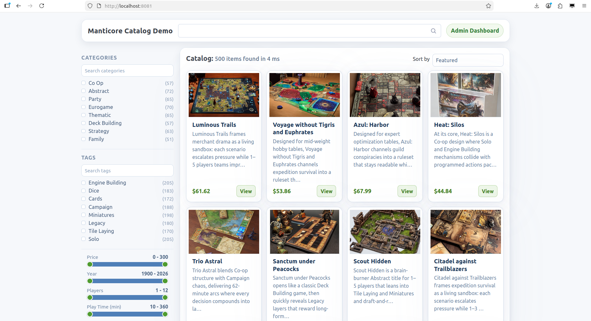
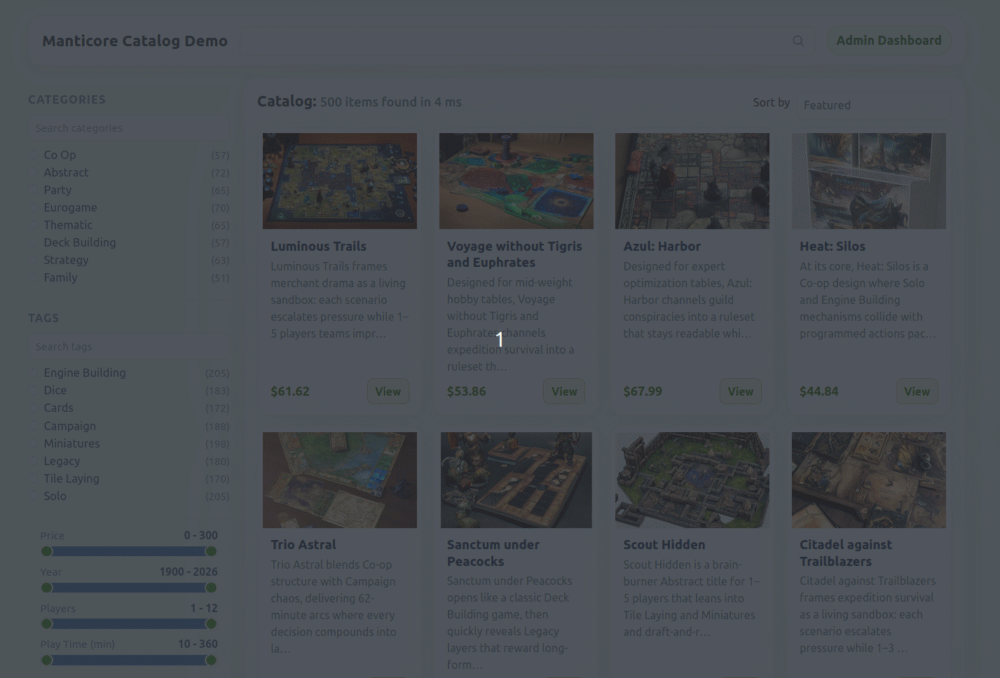
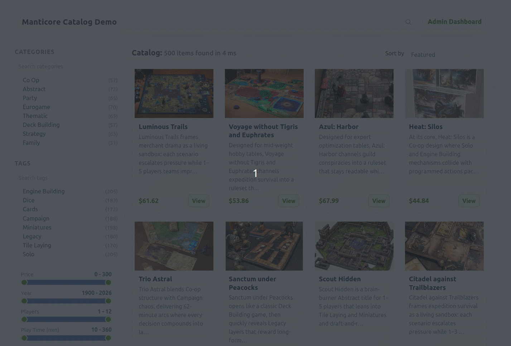
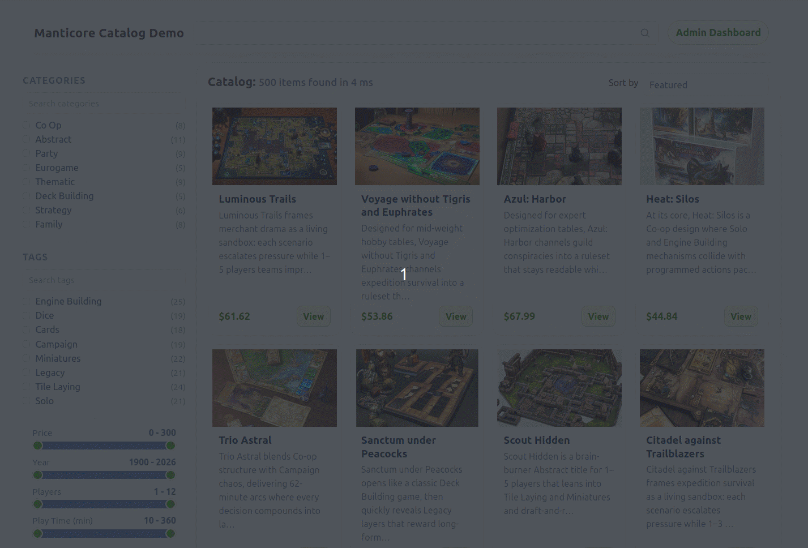
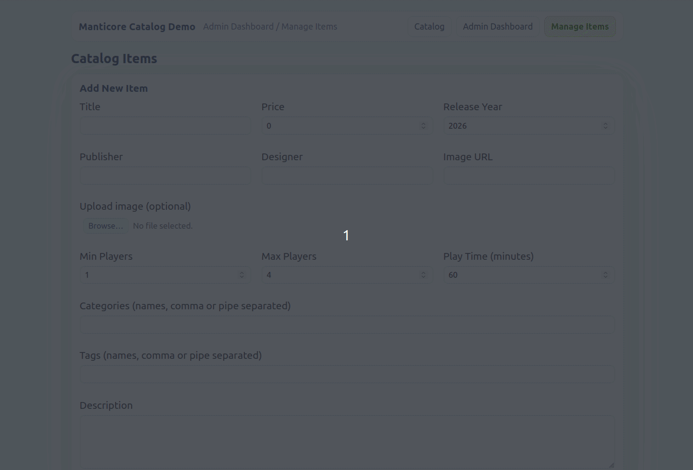

## How to Build Practical Search in PHP with Manticore

If your goal is "users can find the right item quickly," this guide gives you a practical implementation path in PHP with Manticore.

Using a simple demo PHP app for board-game discovery, this guide walks through the user experience from the first query to refining and sorting results, paging through them, and discovering similar items.

You can reuse the same sequence in other PHP apps as a practical rollout plan: start with solid keyword search, then add semantic layers as your project needs them.

---

## See It First

Before setup, you can try the hosted demo to see the end result:

- https://demo-catalog.manticoresearch.com




---

## Local Setup

To run the same flow locally, you only need PHP 8.1+, Composer, and Docker (or any other way to run Manticore). Start by launching Manticore from the repo root:

```bash
cd <repo-root>
docker compose up -d
```

At this point, `docker compose ps` should show the container as running.

Next, move to the app and install dependencies. The application layer in this demo uses the Slim framework for routing and controllers.

```bash
cd <repo-root>/app
composer install
```

Then create your local environment file:

```bash
cp <repo-root>/app/.env.example <repo-root>/app/.env
```

For local runs, this file mainly tells the app how to reach Manticore:

```env
MANTICORE_HOST=127.0.0.1
MANTICORE_PORT=9308
```

If you use the provided Docker setup, these defaults are usually enough.

After this step, the app has what it needs to connect to Manticore using host/port settings from `config/settings.php`.

```php
$settings = require $root . '/config/settings.php';

$client = new Client([
    'host' => $settings['manticore']['host'],
    'port' => $settings['manticore']['port'],
    'transport' => 'Http',
]);
```

Before you can test search behavior, the app needs sample catalog records in Manticore. The bootstrap command creates/recreates the demo table and imports the bundled starter data so you begin from a known state:

```bash
cd <repo-root>/app
php bin/bootstrap-demo.php
```

You should see import progress move in batches until completion, which means the catalog is ready for querying.

Finally, start the app server:

```bash
cd <repo-root>/app
php -S localhost:8081 -t public
```

When you open `http://localhost:8081/`, you should land on a working catalog page where you can immediately search, filter, and open item details.

---

## One Search Journey, End to End

From here, we build the search flow the same way users experience it: type a query for the game they want to find, narrow options to what fits their constraints (for example budget or play time), page deeper through matches, open a game’s detail page and explore similar games.

### Step 1: Help users start a query

Users often start with incomplete terms, so autocomplete helps them shape the query before they submit. In practice, this reduces failed searches caused by wording uncertainty and shortens time to first useful result.

In the UI, this is exposed as live search (search-as-you-type suggestions under the input), so users can pivot before committing to a full results request.

```php
$payload = [
    'body' => [
        'query' => $term,
        'table' => $this->tableName,
        'options' => ['limit' => $limit, 'force_bigrams' => 1],
    ],
];
$suggestions = $this->client->autocomplete($payload);
```



### Step 2: Return useful first-page results

On the first results page, users expect obvious keyword matches, even when they make small typos. Full-text search should be your baseline, and fuzzy mode can improve recall when spelling is imperfect. The tradeoff is that fuzzy matching can broaden results too much for some queries, so it is usually best as an optional or scoped behavior. 

```php
$search = (new Search($this->client))
    ->setTable($this->tableName)
    ->limit($limit);

if ($query !== '') {
    $search->search($query);
    if ($fuzzy) {
        $search->option('fuzzy', 1)->option('force_bigrams', 1);
    }
} else {
    $search->search('*');
}
```



For details on applying fuzzy search in Manticore, see [Spell correction and fuzzy search](https://manual.manticoresearch.com/Searching/Spell_correction#Fuzzy-Search).

### Step 3: Narrow quickly without rewriting the query

When result sets are still broad, filters and facets let users narrow without rewriting the query. Range filters (price, player count, play time, year) handle numeric constraints, while facet counts (categories/tags) show how the current result set is distributed and support one-click refinement.

```php
$attributeFilters = [
    'price_min' => 20,
    'price_max' => 80,
    'release_year_min' => 2018,
    'player_count_min' => 2,
    'player_count_max' => 4,
];

if ($categoryIds !== []) {
    $search->filter('category_id', 'in', $categoryIds);
}
if ($tagIds !== []) {
    $search->filter('tag_id', 'in', $tagIds);
}
$this->applyNumericFilters($search, $attributeFilters);
$search->facet('category_id')->facet('tag_id');
```


### Step 4: Keep exploration stable as users page deeper

Offset pagination can drift when data changes between requests, so this demo uses scroll tokens for "Show more games." In Manticore, the scroll option is designed for deep pagination: instead of paying the cost of larger and larger offsets, each request continues from a returned token. In practice, this gives you more stable continuation, avoids typical deep-offset pitfalls (skips/duplicates), and keeps "load more" behavior predictable as users browse further. See [Manticore Manual: Pagination](https://manual.manticoresearch.com/Searching/Pagination) for details.

```php
// Page 1 starts a fresh scroll session; next pages continue with returned token.
$effectiveScrollToken = $page > 1 ? $scrollToken : null;
$search->option('scroll', $effectiveScrollToken ?? true);

$resultSet = new ResultSet($this->client->search(['body' => $body], true));
$nextScroll = $resultSet->getScroll();
$hasMore = $nextScroll !== null && (string) $nextScroll !== '';
```


### Step 5: Add semantic help when keywords are not enough

Lexical matching does not always capture intent when wording differs, so this is where semantic search helps. In Manticore, hybrid retrieval is done by sending both a lexical `query` block and a semantic `knn` block (knn = k-nearest neighbors, a vector search method used here to find items with similar meaning) in one search request, then fusing their rankings with `options.fusion_method = rrf`. This improves discovery when user wording is close in meaning but not exact in terms.

In our app, that means a query can return both direct keyword hits and semantically related games in one ranked list. 

#### How Auto-Embeddings Help

This demo relies on Manticore auto-embeddings for the vector field, so you do not have to generate vectors in your application by yourself (see [Manticore Manual: Auto Embeddings](https://manual.manticoresearch.com/Searching/KNN#Auto-Embeddings-(Recommended))).

```php
'description_vector' => [
    'type' => 'float_vector',
    'options' => [
        'MODEL_NAME' => 'sentence-transformers/all-MiniLM-L6-v2',
        'FROM' => 'description',
    ],
],
```

With that setup, `knn.query = $query` lets Manticore embed the query text automatically for knn search. 


```php
$body = [
    'query' => ['bool' => ['must' => [['query_string' => ['query' => $query]]]]],
    'knn' => [
        'field' => 'description_vector',
        'query' => $query,
    ],
    'options' => ['fusion_method' => 'rrf'],
    'limit' => $limit,
];
```

On item pages, semantic retrieval solves a different user need: "I like this game, show me close alternatives." It helps users continue discovery without formulating another query, especially when similar games share mechanics or theme but not obvious title keywords. This part uses pure KNN (without lexical query fusion):

```php
$search = new Search($this->client);
$search->setTable($this->tableName)
    ->knn('description_vector', $source->getId(), self::SIMILAR_KNN_LIMIT)
    ->notFilter('id', 'in', [$source->getId()])
    ->limit(self::SIMILAR_RESULT_LIMIT);

$resultSet = $search->get();
$hits = $this->formatResultSet($resultSet)['hits'];
return array_slice($hits, 0, self::SIMILAR_RESULT_LIMIT);
```




---

## Keeping Table Data in Sync with App Writes

In this demo, table data stays in sync through the same app workflow users interact with: baseline bootstrap for a known start, user-triggered batched prepared imports from the admin UI for extra records, and table writes on admin edit/delete actions. Under that workflow, the Manticore PHP client handles imports and admin edits without a separate background layer.

For prepared imports, the app uses the client's batch write functions: `addDocuments()` for append mode and `replaceDocuments()` for deterministic reload/update mode.

```php
$table = $this->client->table($this->indexConfig['name']);

if ($appendAsNewIds) {
    $table->addDocuments($batch);
} else {
    $table->replaceDocuments($batch);
}
```

The controller keeps progress/offset state for the UI, while write operations are executed through these client calls.

For admin writes, the Manticore PHP client's table API is used to perform update/delete operations on individual documents (game items):

```php
if ($id > 0) {
    $this->table->replaceDocument($document, $id);
} else {
    $this->table->addDocument($document);
}

$this->table->deleteDocument($id);
```



If users want to start over while testing, the admin UI provides a reset action that clears imported records and returns the demo to its baseline dataset.

```php
$baseMaxId = $this->resolveBaseMaxId();

$this->table->deleteDocuments([
    'range' => [
        'id' => ['gt' => $baseMaxId],
    ],
]);

$this->clearManageItemsEnabled();
```

This keeps search behavior trustworthy after writes while staying operationally simple in a PHP app.


---

## Conclusion

Overall, this demo shows how to build a practical search experience in a PHP application with Manticore and its PHP client, from the first query to deeper discovery in one coherent flow. The result is a search stack that supports modern relevance needs while remaining clear to implement and maintain. It is also efficient in day-to-day use: one engine and one PHP integration handle key search needs, including lexical search, semantic retrieval, and facets/filters, without splitting search logic across multiple services.
